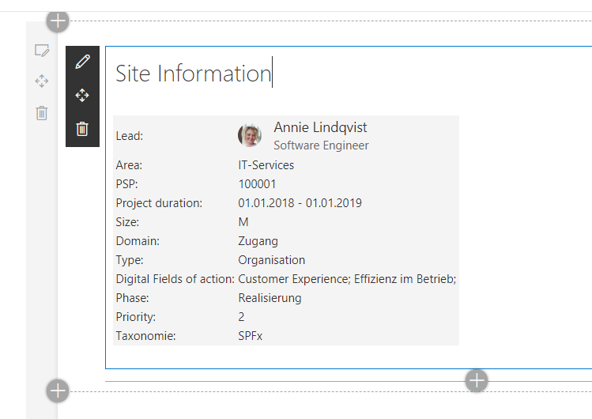
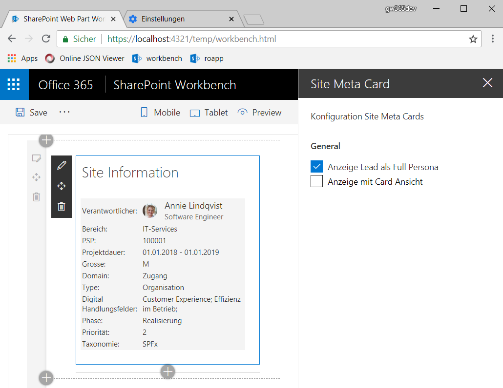
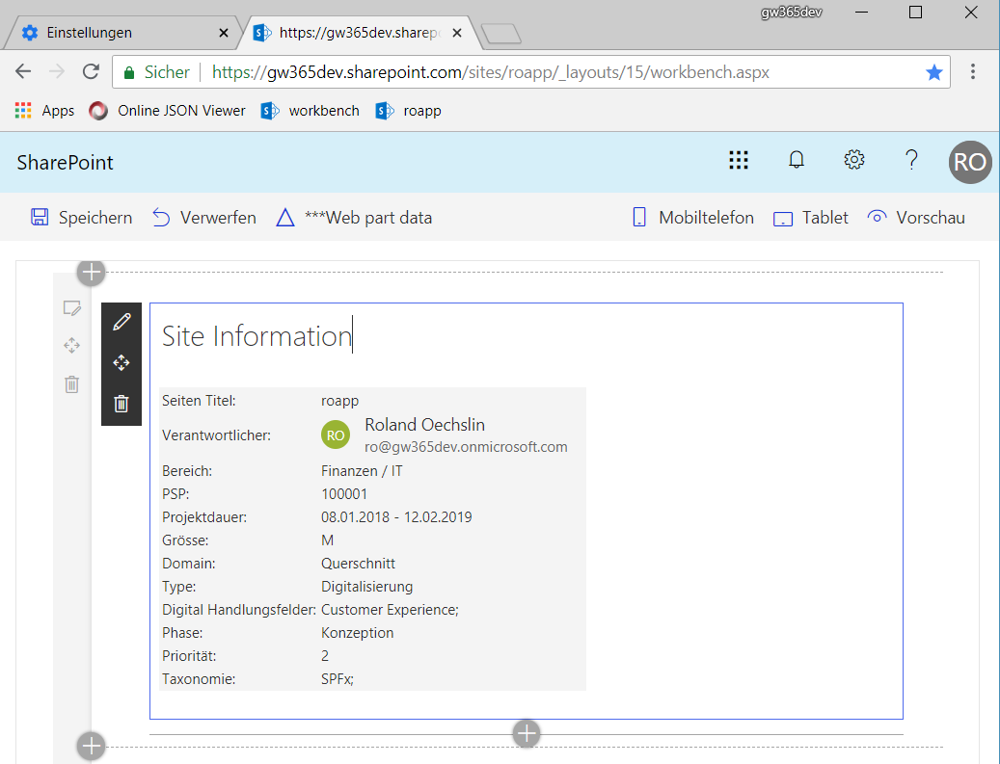

# SPFx Konzepte anhand eines Beispiels

Aufzeigen von diversen Spfx WebPart Konzepten und ihre Umsetzungen im Code.

## Mockdaten

Anzeige von Mockdaten wenn der local server gestartet wird.


[Code Switch Enviroment](https://stash.garaio.com/projects/SPFX/repos/spfxdevcamp2018/browse/src/webparts/siteMetaCard/SiteMetaCardWebPart.ts#35)

[Code Service](https://stash.garaio.com/projects/SPFX/repos/spfxdevcamp2018/browse/src/shared/services/ListMock.ts#523)

## Load data icon

Anzeige eines "Load data..." Icons, wenn der Datenzugriff erfolgt, sobald diese geladen sind, sollen die Daten angezeigt werden.


[Code](https://stash.garaio.com/projects/SPFX/repos/spfxdevcamp2018/browse/src/webparts/siteMetaCard/components/SiteMetaCard.tsx#80)

## Lokalisierung des WebParts

Umschalten der Sprache.


```bs
gulp serve --locale=de-de
```

[Code](https://stash.garaio.com/projects/SPFX/repos/spfxdevcamp2018/browse/src/shared/components/MetaCard/loc)

## Inline editieren des Titels

Der Titel des Webparts kann editiert werden ohne die WebPart Properties zu öffnen.



[Code](https://stash.garaio.com/projects/SPFX/repos/spfxdevcamp2018/browse/src/webparts/siteMetaCard/components/SiteMetaCard.tsx#135)

## WebPart Konfiguration

Anzeige von WebPart Properties, wie die Darstellung veränder werden kann zur Laufzeit.




[Code](https://stash.garaio.com/projects/SPFX/repos/spfxdevcamp2018/browse/src/webparts/siteMetaCard/SiteMetaCardWebPart.ts#66)

## Laden von Sharepoint List Daten

Anzeige eines Listitems aus einer Liste mithilfe der Library https://github.com/pnp/pnpjs. Bei komplexen Lookup oder Taxonomie Felder liefert die Funktion renderListDataAsStream() alle Daten zurück.



```bs
gulp serve --nobrowser --locale=de-de
```

[Code](https://stash.garaio.com/projects/SPFX/repos/spfxdevcamp2018/browse/src/shared/services/SpListService.ts#27)

## Data Service

Very good overview from sebastien levert: [APIs Everywhere](../assets/APIs-Everywhere.pptx)

Sample Folder structur

- src
    - models
        - IHelpDeskItem.ts
    - services
        - IDataService.ts
        - MockDataservice.ts
        - SharepointDataService.ts
    - webparts
        - components
        - loc
        - 'webpartnameWebPart.ts'


### Data Model

Interface to define our Data structure

```tsx
export interface IHelpDeskItem {
  id?: number;
  title?: string;
  description?: string;
  level?: string;
  status?: string;
  assignedTo?: string;
  resolution?: string;
}
```

Interface to define our Data Access services

```tsx
import { IHelpDeskItem } from "./../models/IHelpDeskItem";
import { WebPartContext } from "@microsoft/sp-webpart-base";

export default interface IDataService {
  getTitle(): string;
  isConfigured(): boolean;
  getItems(context: WebPartContext): Promise<IHelpDeskItem[]>;
  addItem(item: IHelpDeskItem): Promise<void>;
  deleteItem(id: number): Promise<void>;
}

```

Mocking Service for testing in local Workbench development

```tsx
import { IHelpDeskItem } from "./../models/IHelpDeskItem";
import IDataService from "./IDataService";
import { IWebPartContext } from "@microsoft/sp-webpart-base";

export default class MockDataService implements IDataService {
...
  private _webPartContext: IWebPartContext;
  private _listId: string;

  constructor(webPartContext: IWebPartContext, listId: string) {
    this._webPartContext = webPartContext;
    this._listId = listId;
  }
...

  public getItems(context: IWebPartContext): Promise<IHelpDeskItem[]> {
    return new Promise<IHelpDeskItem[]>((resolve, reject) => {
      setTimeout(() => resolve([
        {
          id : 1,
          title : "That doesn't work",
          description : "When I do that, it doesn't work",
          level : "Low",
          status: "Open",
          resolution: "Do this and it will work!",
          assignedTo: "Sébastien Levert",
        }
      ]), 300);
    });
  }
}
```

### Get Data with Sharepoint REST

[Source](https://github.com/sebastienlevert/apis-apis-everywhere/blob/master/src/services/SharePointDataService.ts)

```tsx
public getItems(context: WebPartContext): Promise<IHelpDeskItem[]> {
return new Promise<IHelpDeskItem[]>((resolve, reject) => {
    context.spHttpClient
    .get( `${this._webPartContext.pageContext.web.absoluteUrl}/_api/web/lists/GetById('${this._listId}')/items` +
            `?$select=*,HelpDeskAssignedTo/Title&$expand=HelpDeskAssignedTo`, SPHttpClient.configurations.v1)
    .then(res => res.json())
    .then(res => {
        let helpDeskItems:IHelpDeskItem[] = [];

        for(let helpDeskListItem of res.value) {
        helpDeskItems.push(this.buildHelpDeskItem(helpDeskListItem));
        }

        resolve(helpDeskItems);
    })
    .catch(err => console.log(err));
});
}
```

### Get Data with Pnp-JS-Core

Advantages

- Type safe so you get your errors while you code and not when you execute and test
- Works on all versions of SharePoint (On-Premises, Online, etc.)
- Offers built-in caching mechanisms
- Heavily used in the SharePoint Development Community

Init context in react webpart component
[source](https://github.com/sebastienlevert/apis-apis-everywhere/blob/master/src/webparts/listContent/ListContentWebPart.ts)

```tsx
public onInit(): Promise<void> {
    return super.onInit().then(_ => {
        pnpSetup({
        spfxContext: this.context
        });
    });
}
```

init service in react webpart component

```tsx
public render(): void {
    const element: React.ReactElement<IListContentProps> = React.createElement(
      ListContent,
      {
        context: this.context,
        dataService: this.getDataService(),
        list: this.properties.list
      }
    );

    ReactDom.render(element, this.domElement);
}
```

Get items from list
[Source](https://github.com/sebastienlevert/apis-apis-everywhere/blob/master/src/services/PnPJSCoreDataService.ts)

```tsx
public getItems(context: WebPartContext): Promise<IHelpDeskItem[]> {
return new Promise<IHelpDeskItem[]>((resolve, reject) => {

    sp.web.lists.getById(this._listId).items
    .select("*", "HelpDeskAssignedTo/Title")
    .expand("HelpDeskAssignedTo").getAll().then((sessionItems: any[]) => {
    let helpDeskItems:IHelpDeskItem[] = [];

    for(let helpDeskListItem of sessionItems) {
        helpDeskItems.push(this.buildHelpDeskItem(helpDeskListItem));
    }

    resolve(helpDeskItems);
    });

});
}
```

