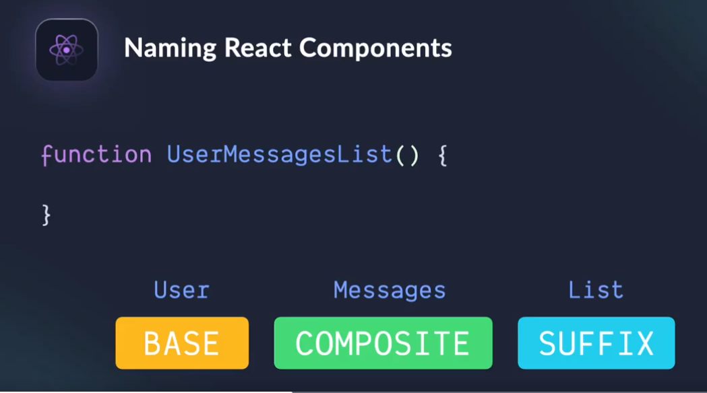

# React Learning

- [react Roadmap](https://roadmap.sh/react)
- [German - React lernen und verstehen](https://lernen.react-js.dev/)

## React Documentation / Tutorial

- [react.dev](https://react.dev/learn/describing-the-ui)
- [create-react-app.dev](https://create-react-app.dev/docs/adding-typescript/)
- [react-dom-components-common](https://react.dev/reference/react-dom/components/common)
- [react-lernen](https://github.com/manuelbieh/react-lernen)
- [react-tutorial](https://react-tutorial.app/)

## Typescript

- [typescriptlang-handbook](https://www.typescriptlang.org/docs/handbook/intro.html)
- [typescript-cheatsheets](https://github.com/typescript-cheatsheets/react#reacttypescript-cheatsheets)
- [totaltypescript - React with TypeScript](https://www.totaltypescript.com/tutorials/react-with-typescript) 

## Style guide

- [airbnb-react](https://github.com/airbnb/javascript/tree/master/react#airbnb-reactjsx-style-guide)
- [airbnb-javascript](https://github.com/airbnb/javascript#airbnb-javascript-style-guide-)
- [typescript-styleguide](https://basarat.gitbook.io/typescript/styleguide)
- [Naming cheatsheet](https://github.com/kettanaito/naming-cheatsheet)
- [clean-code-javascript](https://github.com/ryanmcdermott/clean-code-javascript)

## Naming

- [Naming React Component](https://x.com/_georgemoller/status/1737643851966210544?s=20)



## Patterns for React

- [Container/Presentational Pattern](https://www.patterns.dev/react/presentational-container-pattern)

## Markdown

- [markdownguide-basic-syntax](https://www.markdownguide.org/basic-syntax/)
- [onvert-markdown-to-word-document](https://mrjoe.uk/convert-markdown-to-word-document/)

## VS Code Extension

- [Typescript React code snippets](https://marketplace.visualstudio.com/items?itemName=infeng.vscode-react-typescript)
- [Path Intellisense](https://marketplace.visualstudio.com/items?itemName=christian-kohler.path-intellisense)
- [npm Intellisense](https://marketplace.visualstudio.com/items?itemName=christian-kohler.npm-intellisense)
- [Prettier - Code formatter](https://marketplace.visualstudio.com/items?itemName=esbenp.prettier-vscode)
- [Template String Converter](https://marketplace.visualstudio.com/items?itemName=meganrogge.template-string-converter)

### Markdown to Word

```ps  
pandoc -o output.docx -f markdown -t docx filename.md
```

## Libs

- [npmjs](https://www.npmjs.com/)


## Creating Typescript React Project

```ps  
cd C:\ProgrammeBLS\projects
npx create-react-app quickstart --template typescript
```

## JSX, TSX Converter

- [html-to-jsx](https://transform.tools/html-to-jsx)


## Recap

### importing-and-exporting-components

- [default-vs-named-exports](https://react.dev/learn/importing-and-exporting-components#default-vs-named-exports)

### conditional-rendering

- In React, you control branching logic with JavaScript.
- You can return a JSX expression conditionally with an if statement.
- You can conditionally save some JSX to a variable and then include it inside other JSX by using the curly braces.
- In JSX, {cond ? <A /> : <B />} means “if cond, render <A />, otherwise <B />”.
- In JSX, {cond && <A />} means “if cond, render <A />, otherwise nothing”.

### passing-props-to-a-component

- To pass props, add them to the JSX, just like you would with HTML attributes.
- To read props, use the function Avatar({ person, size }) destructuring syntax.
- You can specify a default value like size = 100, which is used for missing and undefined props.
- You can forward all props with <Avatar {...props} /> JSX spread syntax, but don’t overuse it!
- Nested JSX like <Card><Avatar /></Card> will appear as Card component’s children prop.
- Props are read-only snapshots in time: every render receives a new version of props.
- You can’t change props. When you need interactivity, you’ll need to set state.

### React Function components

- [what-are-react-pure-functional-components](https://blog.logrocket.com/what-are-react-pure-functional-components/)
- [react-function-component](https://www.robinwieruch.de/react-function-component/)

More Infos 

- [react-conditional-rendering](https://refine.dev/blog/react-conditional-rendering/#introduction)
- [the-ultimate-guide-to-conditional-rendering-in-react](https://blog.bitsrc.io/the-ultimate-guide-to-conditional-rendering-in-react-1-3f3a436c0374)

## Samples

- [react-typescript-todomvc-2022](https://github.com/laststance/react-typescript-todomvc-2022)
- [bulletproof-react](https://github.com/alan2207/bulletproof-react)
- [cypress-realworld-app](https://github.com/cypress-io/cypress-realworld-app)
- [Frontend Clean Architecture](https://github.com/bespoyasov/frontend-clean-architecture)
- [Awesome Codebases](https://github.com/alan2207/awesome-codebases)
- [refine - React-based CRUD](https://github.com/refinedev/refine)
- [payloadcms](https://payloadcms.com/)

## Samples Videos

- [Typescript Learning Videos](https://www.youtube.com/@basarat)
- [React Typescript Video Tutorial](https://www.youtube.com/watch?v=Z5iWr6Srsj8)
- [Fullstack React GraphQL TypeScript Video Tutorial](https://www.youtube.com/watch?v=I6ypD7qv3Z8https://www.youtube.com/watch?v=I6ypD7qv3Z8)

## State Management

- [React State Management – Intermediate JavaScript Course](https://www.youtube.com/watch?v=-bEzt5ISACA)
- [Source for React State Management](https://github.com/jherr/fcc-state)